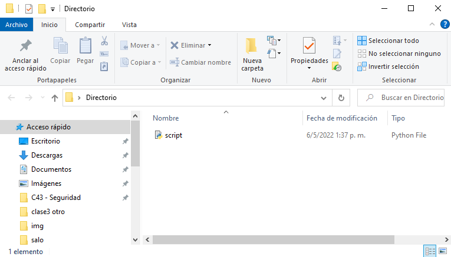
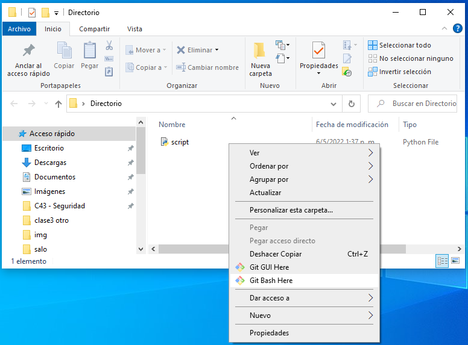
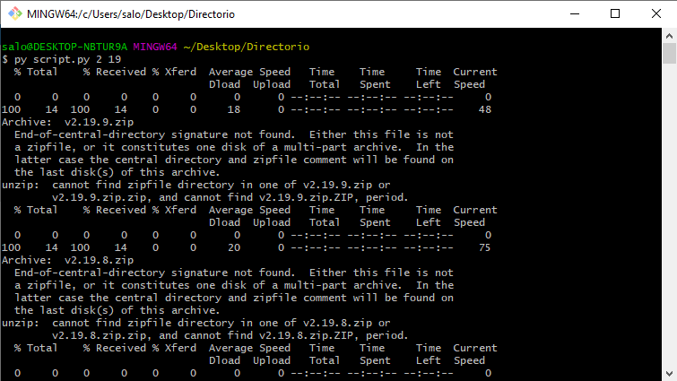
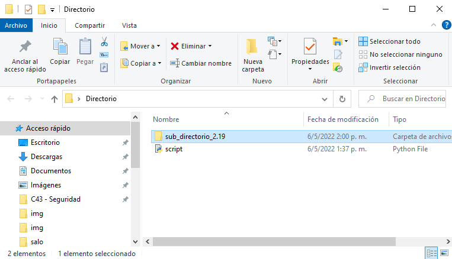

# Test SRE & DevOps

## Consigna

Obtener contenido zip de la versión previa a la confirmación por versión principal y secundaria.

Proporcione una demostración del script que coloque el contenido del último archivo zip de versión preliminar en un subdirectorio.

Las versiones previas a la confirmación se almacenan en  GitHub: https://github.com/pre-commit/pre-commit/releases.

La versión debe especificarse por número de versión principal y secundaria como argumento.

Por ejemplo:

Para las entradas "2" y "14" debe poner contenido de https://github.com/pre-commit/pre-commit/archive/refs/tags/v2.14.zip en un subdirectorio.

El número de parche es siempre el último disponible.

Para las entradas "2" y "17" debe poner contenido de 
https://github.com/pre-commit/pre-commit/archive/refs/tags/v2.17.0.zip en un subdirectorio.

Notas importantes: Elija cualquier tecnología como desee Prepárese para demostrar la funcionalidad y 
las tecnologías utilizadas

Asegúrese de descargar la última versión para determinados mayores y menores 

## Tecnologias

- Lenguaje: Python 3.9
    - Modulos : os (para operaciones de la terminal) y sys (para argumentos de entrada).

- Editor: Visual Studio Code

- Terminal: GitBash

## Ejecución

1 - Descargar script.py y ponerlo en un directorio vacio de referencia. por ejemplo "Directorio".

2 - Abrir la terminal GitBash y posicionarse en el directorio de referencia.

3 - Ejecutar el script con el comando "py script.py [Arg #1] [Arg #2]".
Para este ejemplo ejecutamos "py script.py 2 19"

4 - Listo!!! Verificamos el contendio

